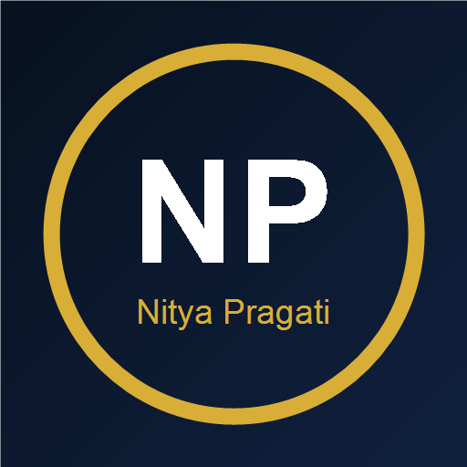

<div align="center">

# 🌟 NityaPragati

### ನಿತ್ಯ ಪ್ರಗತಿ — "Every Day, Small Progress"

**Your Kannada-first digital practice companion for Karnataka KPSC SDA / FDA exams**

`React Native` · `Expo` · `TypeScript` · `Kannada-first`

<br />



<br />


</div>

---

## 🎯 About

> *"ನಿತ್ಯ ಪ್ರಗತಿ"* (NityaPragati) means **"daily progress"** — the belief that small, consistent improvements compound into exam success.

NityaPragati is a **Kannada-first** mobile practice platform purpose-built for candidates preparing for Karnataka's **KPSC SDA / FDA** examinations. Instead of importing generic question banks, it offers **structured, categorized practice**, honest **previous-year paper models**, and daily **current affairs** — all inside a clean, light, distraction-free interface.

Every bit of your data lives **on your device only**. No accounts, no cloud, no servers — your progress belongs to you.

---

## ✨ Features

| | Feature | Description |
| :-: | --- | --- |
| 📚 | **6 Practice Modules** | History, Kannada Grammar, Constitution, Geography, Aptitude & GK — each with topics, explanations & concept links |
| 📖 | **Explanations for Every Question** | Clear Kannada-first explanations with related-concept references, so you learn *why*, not just *what* |
| 🗞️ | **Daily Current Affairs** | Updates with "why it matters for KPSC", sourced honestly — never masquerading as official material |
| 📋 | **Previous-Year Paper Models** | Real-paper *structure* practice under timed conditions, clearly labelled practice/model |
| 📊 | **Rich Analytics** | Subject-wise accuracy, topic & difficulty breakdowns, trends and daily stat cards |
| 🤖 | **AI Tutor & Insights** | Rule-based Kannada insights: strengths, improvement areas, recommendations & action plans |
| 🏆 | **Streaks & Achievements** | Gamified milestones that keep you practicing daily |
| 🔖 | **Bookmarks** | Save and revisit any question, any time |
| 🔒 | **Privacy-First, Offline** | All progress stored locally (AsyncStorage) — nothing leaves your device |
| 🎨 | **Polished Kannada UI** | Baloo Tamma 2 & Noto Sans Kannada, a consistent white–blue design system |

---

## 🧰 Tech Stack

| Layer | Technology |
| --- | --- |
| Language | [TypeScript](https://www.typescriptlang.org/) (strict) |
| Framework | [React Native](https://reactnative.dev/) + [Expo](https://expo.dev/) SDK 51 |
| Navigation | `@react-navigation/native` (bottom tabs + stack) |
| Charts | `react-native-svg` custom charts |
| Motion | `react-native-reanimated` + `react-native-gesture-handler` |
| Persistence | `@react-native-async-storage/async-storage` (100% local) |
| Fonts | `@expo-google-fonts/baloo-tamma-2` · `noto-sans-kannada` |
| Gradients | `expo-linear-gradient` |

---

## 🚀 Getting Started

### Prerequisites
- **Node.js** (v18+) & npm
- **Expo Go** on your phone, or an Android/iOS emulator

### Run it

```bash
# 1. Install dependencies
npm install

# 2. Start the dev server
npm start                    # or: npx expo start

# 3. Scan the QR with Expo Go, or press:
#    a → Android emulator      i → iOS simulator      w → web
```

### Run on a device
```bash
npm run android   # launch on an Android emulator / connected device
npm run ios       # launch on an iOS simulator
```

---

## 📁 Project Structure

```
nitya-pragati/
├── App.tsx                   # App entry & providers
├── app.json                  # Expo configuration
├── assets/                   # Icons, splash & developer photo
├── src/
│   ├── components/           # Reusable UI (cards, buttons, charts…)
│   ├── config/app.ts         # ⚙️ App & developer configuration
│   ├── data/                 # Questions, subjects, papers, affairs…
│   │   └── questions/        # Per-subject question banks
│   ├── navigation/           # Navigator & screen routes
│   ├── screens/              # All app screens
│   │   └── components/       # Screen-local components (headers, modals)
│   ├── theme/                # 🎨 Colors, fonts, spacing, shadows, radii
│   ├── types/                # 🔒 Domain types & routes
│   └── utils/                # AI tutor, storage & progress logic
└── ...
```

---

## ⚙️ Configuration

Everything app-level is centralized in **`src/config/app.ts`** — one file, no hunting.

```ts
export const DEVELOPER = {
  name: 'Abhishek',
  linkedInUrl: '',                      // 👉 set your LinkedIn profile
  photoSource: null,                    // 👉 point at /assets/your-photo.jpg
};
```

- **LinkedIn** → set `DEVELOPER.linkedInUrl`
- **Developer photo** → drop a photo in `assets/` and set `photoSource: require('./../../assets/your-photo.jpg')`
- **Contact email** → update `CONTACT.email`

---

## 🖥️ Screens

| | Screen | Purpose |
| :-: | --- | --- |
| 🏠 | Home | Subject modules, quick tests & daily challenge |
| 📝 | Tests | Previous-year, practice, aptitude, GK & reasoning sets |
| 🗞️ | Updates | Daily current-affairs hub |
| 📈 | Insights | AI-powered progress analytics & streaks |
| 📖 | Quiz / Result | Timed practice with instant explanation feedback |
| 🤖 | AI Tutor | Rule-based exam-prep assistant |
| 🔖 | Bookmarks | Saved questions collection |
| ℹ️ | About / Developer / Help / Privacy / Contact | App info & developer section |

---

## �licite & Production Build

```bash
npx expo prebuild      # generate native android/ios projects
npm run build          # EAS build (requires Expo account)
```

---

## 🧠 How it works

1. **Practice** — pick a subject or test set; answer timed questions.
2. **Learn** — every answer unlocks an explanation & related concept.
3. **Track** — accuracy, timing and trends feed your analytics.
4. **Improve** — AI insights surface weak spots and recommend next steps.
5. **Repeat daily** — streaks & achievements keep the momentum. 🌟

---

## 👨‍💻 Developer

Built with 💙 by **Abhishek** — designer & developer of NityaPragati.

---

## 🛡️ License

This project is currently **private / unlicensed**. No permission is granted to use, copy, modify, or distribute it without the owner's written consent.

---

<div align="center">

**ಅಭ್ಯಾಸ ಮುಂದುವರಿಸಿ — ಪ್ರತಿದಿನ ಸ್ವಲ್ಪ ಸುಧಾರಣೆ! 🌟**

</div>
```
<h2>📱 App Screenshots</h2>

<p align="center">
  
  
  
  
</p>
